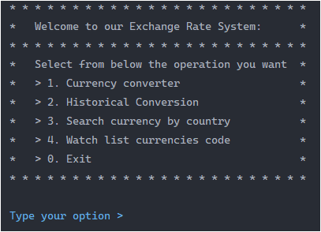
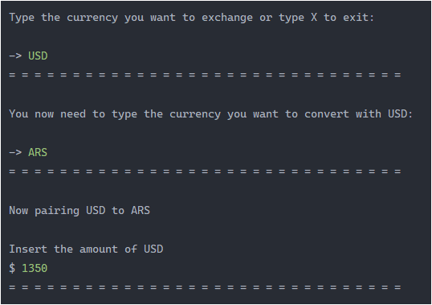
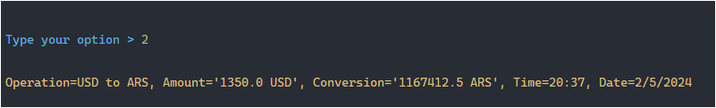
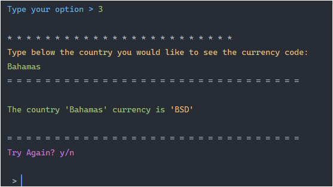
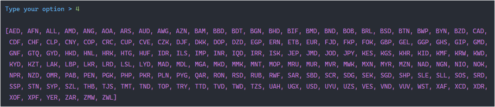
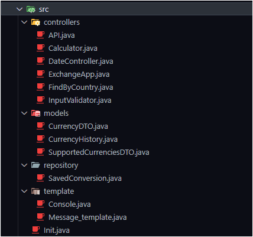

## Introduction
##### We use the API from https://www.exchangerate-api.com/

    This Application is used for many options..
        Getting currency rate
        Getting the conversion history
        Search for currency code by country
        Watch all supported currencies

## What i've used
JDK 21

IDE IntelliJ IDEA

Gson (Dependency)

## Getting Started
#### This is what the menu looks like

> [!NOTE]
> You need to type a number from 1 to 4 or 0 to exit

> [!WARNING]
> Non numbers sent will be invalid

#### Currency Converter

#### History Conversions

#### Find Currency code by Country

#### Supported currencies

## Folder Structure

##### This is the Structure explained

> #### Controllers
>> API: For the request for conversion.
>> 
>> Calculator: To convert the amount to the currency assigned.
>> 
>> DateControllers: Get the information of the current date and time.
>> 
>> ExchangeApp: Is used for the main menu.
>> 
>> FindByCountry: Assigns the user input country send and returns the currency code.
>> 
>> InputValidator: Is to validate if the user input option is a number or not by using try-catch.
> #### Models
>> CurrencyDTO: Is used to save the json request in a Map to manipulate the information.
>> 
>> CurrencyHistory: Is connected with the 'repository/SavedConversion', it has a template to then save to the List from 'SavedConversion'.
>> 
>> SupportedCurrenciesDTO: It has two Arrays one that is from the API and the other that is locally, actually the Online Table is deprecated and we are using the local table to get the supported currencies. Also has the methods to get if is empty, find currency by code (when users input the currency code), and get all the currencies from the table.
> #### Repository
>> SavedConversion: As we mention before this is the storage of the conversion history saved on a List
> #### Template
>> Console: This has two methods for coloring the output console text, for simplify the usage. (Example: System.out.println(Console.RED + "This is a message" + Console.RESET))  I've simply by using 'Console.color' or 'Console.inputColor'
>  'Console.color' uses 'println' and 'Console.inputColor' uses 'print'
>> 
>> Message_template: It has most of the console output messages.
> #### Main
>> Init: This is where we exec the App.

